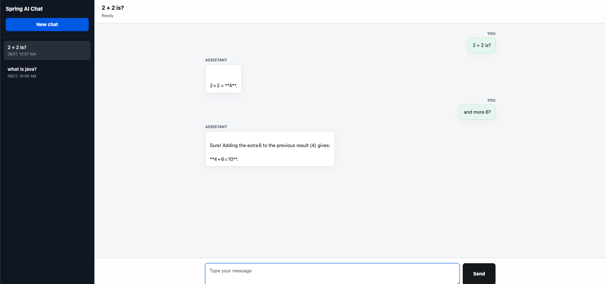
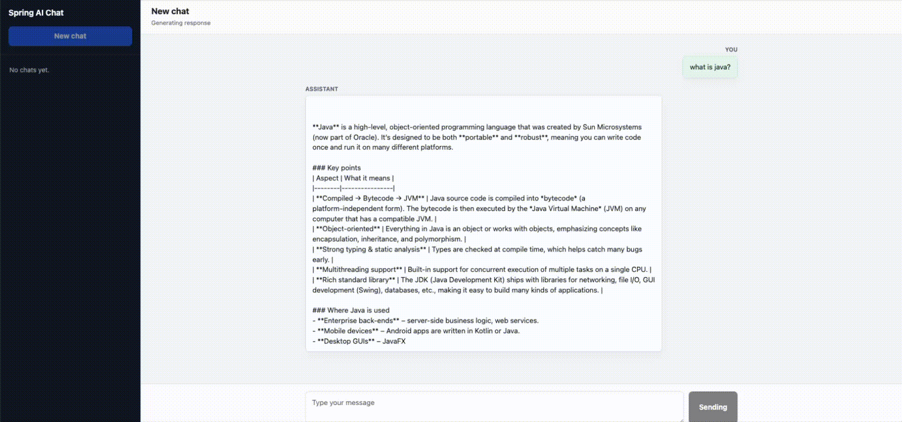

# Chat using spring ai and LM Studio


```shell
# get sessions
curl http://localhost:8080/sessions

# get session by id
curl http://localhost:8080/sessions/1

# start chat
curl -X POST http://localhost:8080/chat/ -d '{ "prompt": "Hello"}'
```

Simple UI: open http://localhost:8080/

UI:


<br>
<br>
<br>
    
Chat stream:

