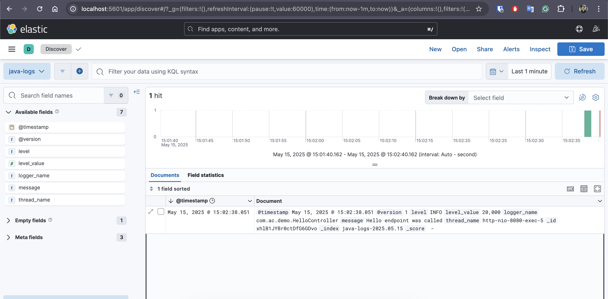
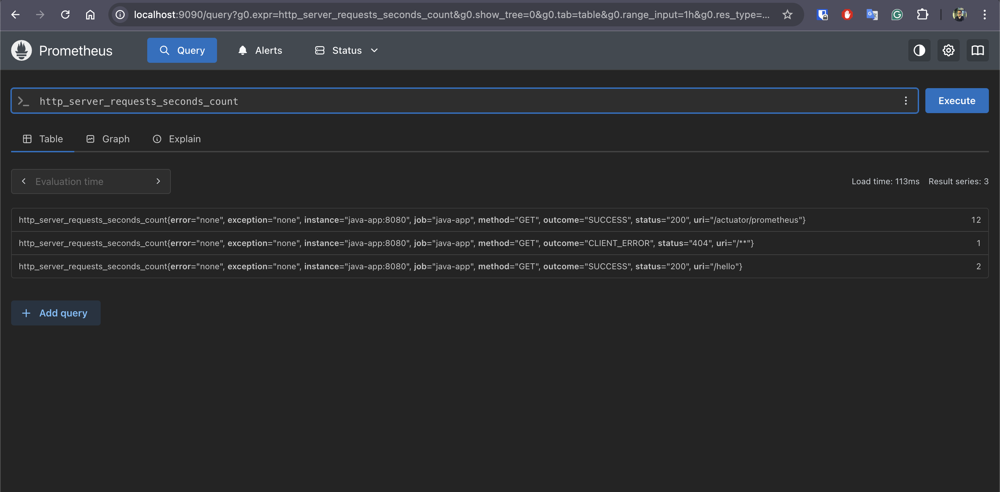

# docker-compose with Prometheus, Spring Boot App, Grafana and ELK, all integrated and working


```
docker-compose up
```

Once everything is up run script to create index pattern on Kibana
```
./kibana/create_index_pattern.sh 
```

Access kibana dashboard:
http://localhost:5601/




Access prometheus server:
http://localhost:9090/



