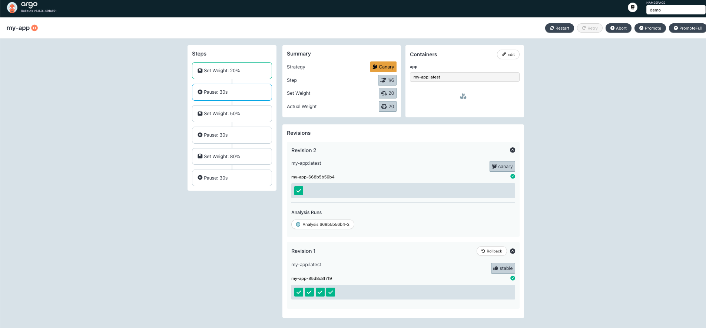
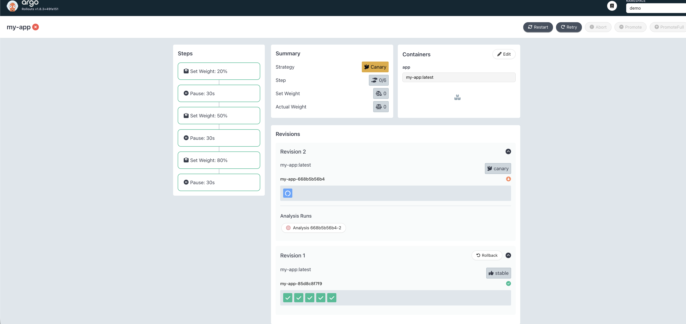

# POC Argo Rollouts Canary automate rollback

- Go app, when DB_URL is empty or unset it counts as error
- Argo Rollouts
- Helm
- Prometheus


```shell
# deploy the service
make setup deploy

# open the dashboard and select namespace demo
make dashboard

# send requests to api endpoint
make curl

# start canary with issues
make canary-bad 
```

Starting the rollout:


Rollback:

