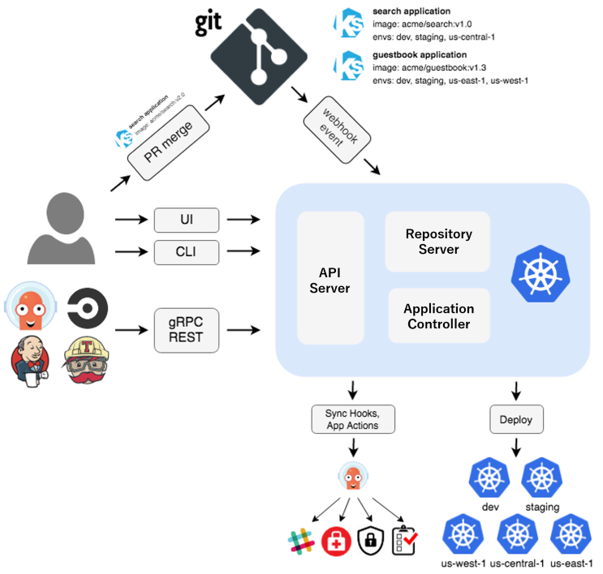
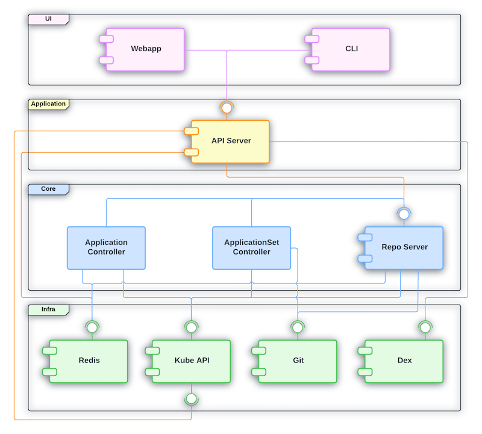

# ArgoCD

- GitOps delivery tool
- Git souce of true
- Argo deploy the app to k8s cluster
- Keep the desired state in git repository in sync with kubernetes
- Pull based

### Components

__API Server__
- gRPC/REST server which exposes the API consumed by the Web UI, CLI, and CI/CD systems

__Repository Server__
- local cache of the Git repository

__Application Controller__
- is a Kubernetes controller which continuously monitors running applications and compares the current

## ArgoCD Architecture


### ArgoCD Architecture Component


### ArgoCD Sync Options

Argo CD polls Git repositories every three minutes to detect changes to the manifests. 
To eliminate this delay from polling, the API server can be configured to receive webhook events.

``` yml
spec:
  syncPolicy:
    automated:
        prune: true
        selfHeal: true
    syncOptions:
      - Replace=true
      - CreateNamespace=true
      - PruneLast=true
      - ApplyOutOfSyncOnly=true
```

**Resource Level**
```yml
metadata:
  annotations:
    argocd.argoproj.io/sync-options: Prune=false
```

### ArgoCD Phases and Waves 

**Phases**
- pre-sync
- sync
- post-sync
- post-sync-fail

**Waves**

- The phase
- The wave they are in (lower values first for creation & updation and higher values first for deletion)
- By kind [(e.g. namespaces first and then other Kubernetes resources, followed by custom resources)](https://github.com/argoproj/gitops-engine/blob/bc9ce5764fa306f58cf59199a94f6c968c775a2d/pkg/sync/sync_tasks.go#L27-L66)
- By name 


### ArgoCD Projects

- clusterResourceWhitelist
- namespaceResourceBlacklist
- namespaceResourceWhitelist
- destinations
- sourceRepos
- roles