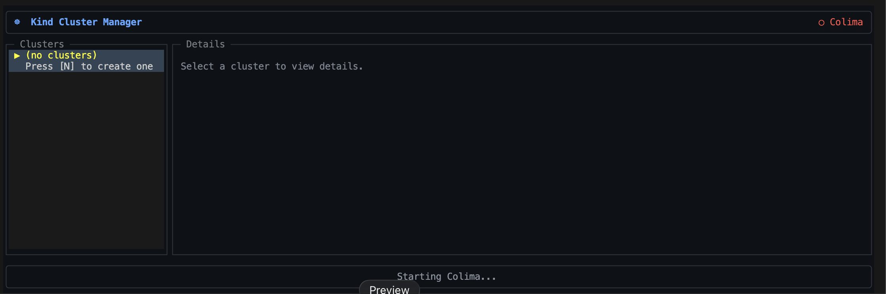
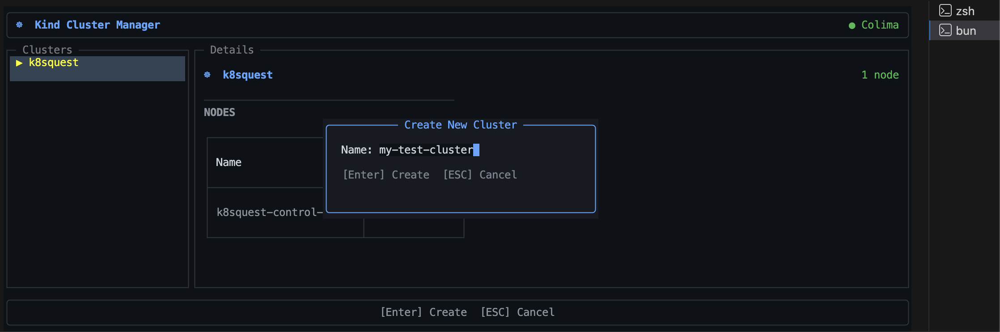
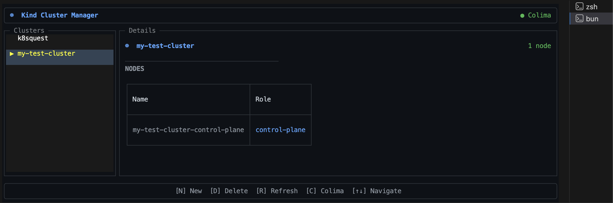

# core

To install dependencies:

```bash
bun install
```

To run:

```bash
bun dev
```

To build executable:
```bash
bun run build
```

This project was created using `bun create tui`. [create-tui](https://git.new/create-tui) is the easiest way to get started with OpenTUI.

### Starting colima


### Creating kind cluster


### Cluster detail


